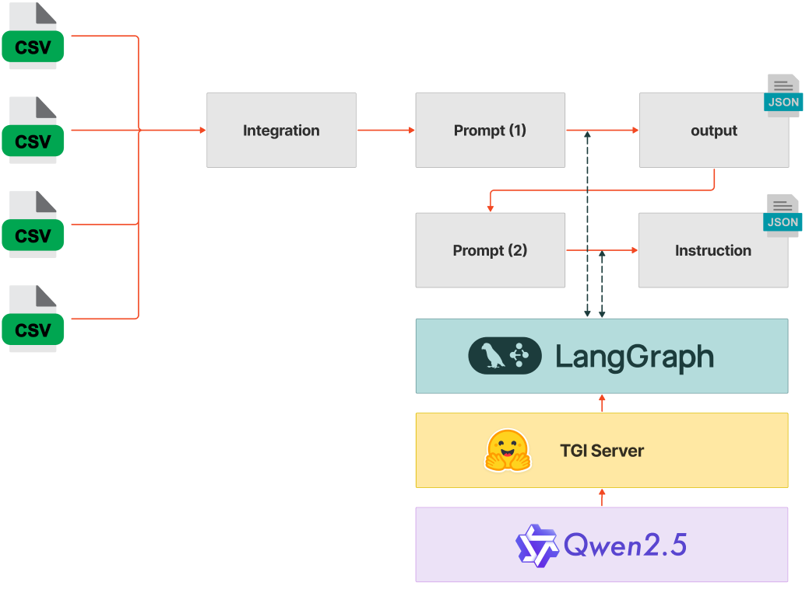

# DataGeneration

### This is repo for making a dataset with LLM

You can install libraries with poetry

```bash
step 1. curl -sSL https://install.python-poetry.org | python3 -
step 2. export PATH="$HOME/.local/bin:$PATH"
step 3. poetry --version
```

if step 3 is done, you can just use this command

```bash
poetry install
```

### Repo Structure
- config : configuration for the project
- data : data for the project
- models : models for the project (we used huggingface endpoint not GPT)
- notebooks/powerplant : making a dataset with Power Plant Glossary

### notebooks/powerplant
- DataGenerate.ipynb : making a dataset with Power Plant Glossary

    - 
